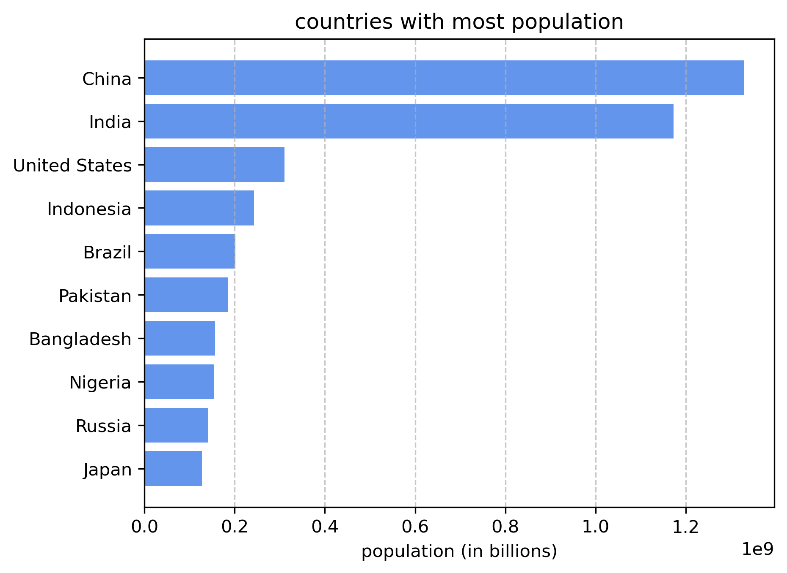

# Global Demographics Web Scraper

An end-to-end Python data engineering pipeline that extracts, cleans, and visualizes global population data. 

###  Project Overview
This project demonstrates a complete data extraction workflow. It bypasses basic automated scraping blocks, extracts raw HTML data using BeautifulSoup, cleans and converts string data into mathematical formats using Pandas, and generates business-ready insights using Matplotlib.

###  Tech Stack
* **Requests:** Securely fetching HTML data
* **BeautifulSoup4:** Parsing DOM elements and extracting HTML tags
* **Pandas:** Data cleaning, type conversion, and tabular structuring
* **Matplotlib:** Data visualization

###  Insights & Visualizations
Below is the horizontal bar chart generated directly from the scraped data, highlighting the top 10 most populous countries in the dataset:

###  Repository Contents
* `extraction.ipynb` - The main Jupyter Notebook containing the scraper, data cleaner, and visualization logic.
* `global_demographics.csv` - The final cleaned dataset extracted from the web.
* `population_top10.png` - The exported Matplotlib visualization.

###  What I Learned
* Dealing with `NoneType` errors and hidden HTML structures.
* Converting scraped string numbers into floats/integers for Pandas queries.
* Navigating Git terminal pushes using GitHub Personal Access Tokens (PAT).